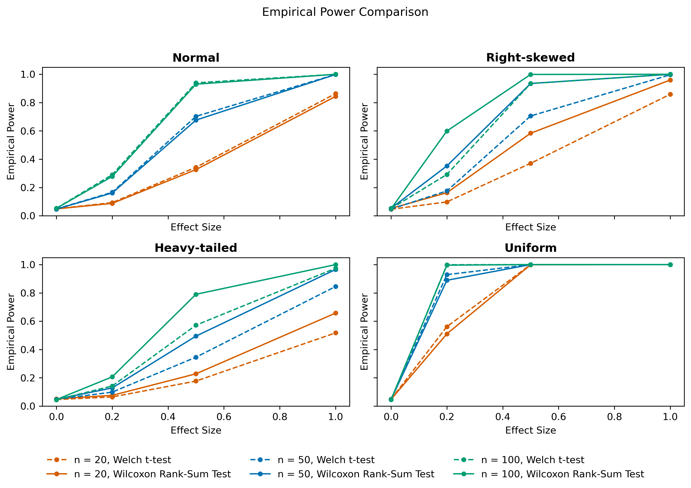

# Comparing the Empirical Power of the Welch t-Test and Wilcoxon Rank-Sum Test

This project compares the empirical power of two-sample hypothesis tests under normal, skewed, heavy-tailed, and uniform data-generating distributions using Monte Carlo simulation.

## Project Overview
I implemented the original simulation study in R and then recreated the workflow in Python to compare results across statistical computing environments. The study evaluates performance across multiple sample sizes and effect sizes, with a focus on how distribution shape affects power and Type I error.

## Tools Used
* R
* Python
* NumPy
* pandas
* SciPy
* matplotlib
* Monte Carlo simulation

## Repository Structure
* `r/` contains the R Markdown report and rendered PDF
* `python/` contains the Python simulation script, plotting script, and saved results
* `python/figures/` contains the final Python visualization

## Key Findings
* The Welch t-test performs best under normality
* The rank-based test performs better under skewed and heavy-tailed data
* Under symmetric non-normal data, both methods perform similarly

## Preview

## Files
* [R Analysis (R Markdown)](r/hypothesis-test-power-simulation.rmd)
* [R Report (PDF)](r/hypothesis-test-power-simulation.pdf)
* [Python Simulation Script](python/hypothesis-test-power-simulation.py)
* [Python Plotting Script](python/plot-power-results.py)
* [Python Simulation Results (CSV)](python/power-results.csv)
* [Python Power Plot](python/figures/power-plot.png)
